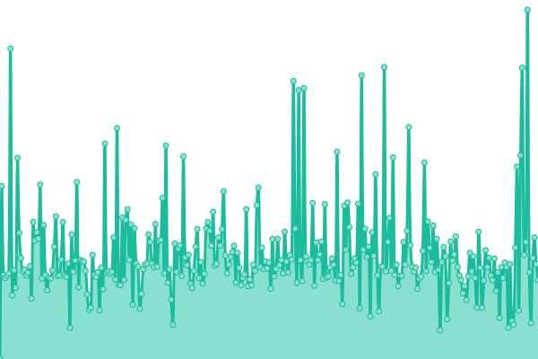
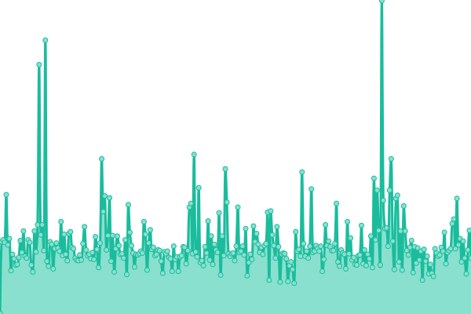
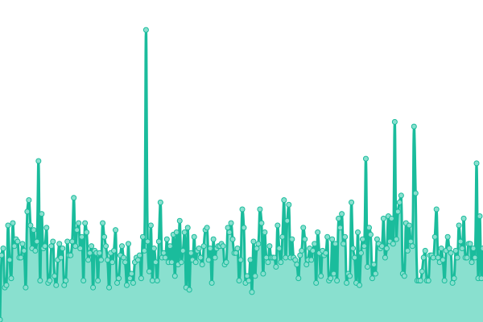
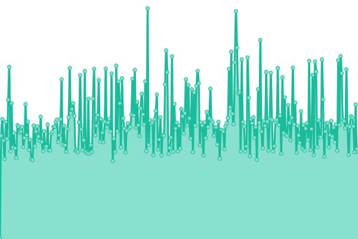
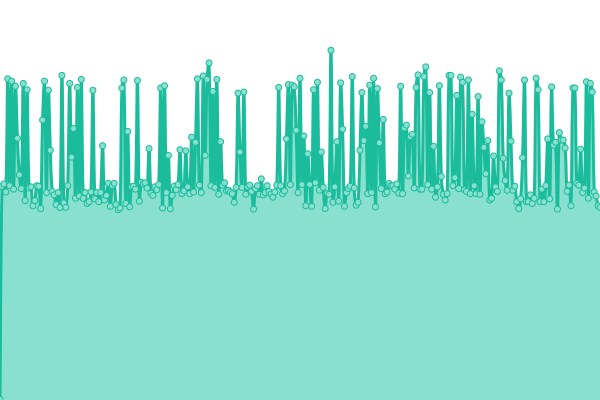
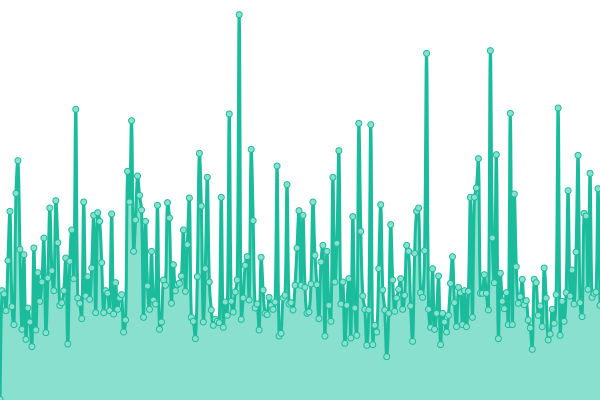
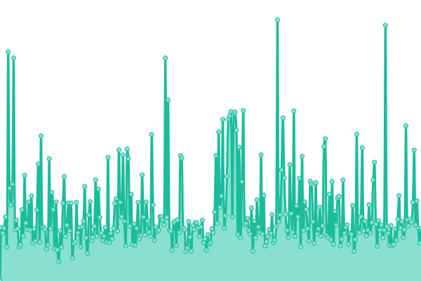
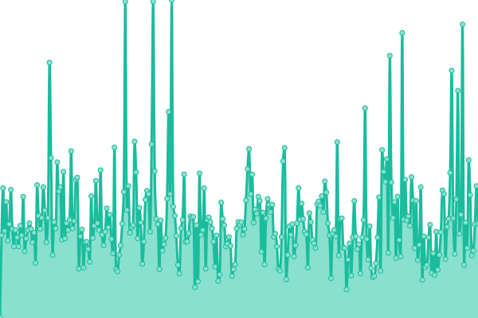

This repository contains the open-source uptime monitor and status page for [Wdes](https://wdes.fr), powered by [Upptime](https://github.com/upptime/upptime).

With [Upptime](https://upptime.js.org), you can get your own unlimited and free uptime monitor and status page, powered entirely by a GitHub repository. We use [Issues](https://github.com/wdes/status/issues) as incident reports, [Actions](https://github.com/wdes/status/actions) as uptime monitors, and [Pages](https://status.datacenters.network) for the status page.

<!--start: status pages-->
<!-- This summary is generated by Upptime (https://github.com/upptime/upptime) -->
<!-- Do not edit this manually, your changes will be overwritten -->
<!-- prettier-ignore -->
| URL | Status | History | Response Time | Uptime |
| --- | ------ | ------- | ------------- | ------ |
|  [Wdes FR](https://wdes.fr) | 🟩 Up | [wdes-fr.yml](https://github.com/wdes/status/commits/HEAD/history/wdes-fr.yml) | 

 563ms
     
 | 

<a href="https://status.datacenters.network/history/wdes-fr">100.00%</a>
    

|  [Wdes EU](https://wdes.eu) | 🟩 Up | [wdes-eu.yml](https://github.com/wdes/status/commits/HEAD/history/wdes-eu.yml) | 

 368ms
     
 | 

<a href="https://status.datacenters.network/history/wdes-eu">100.00%</a>
    

|  [Google 204](https://google.com/generate_204) | 🟩 Up | [google-204.yml](https://github.com/wdes/status/commits/HEAD/history/google-204.yml) | 

 32ms
     
 | 

<a href="https://status.datacenters.network/history/google-204">100.00%</a>
    

|  DC4 server | 🟩 Up | [dc-4-server.yml](https://github.com/wdes/status/commits/HEAD/history/dc-4-server.yml) | 

 457ms
     
 | 

<a href="https://status.datacenters.network/history/dc-4-server">99.11%</a>
    

|  [Sn-bretagne](https://sn-bretagne.net/liens) | 🟩 Up | [sn-bretagne.yml](https://github.com/wdes/status/commits/HEAD/history/sn-bretagne.yml) | 

 382ms
     
 | 

<a href="https://status.datacenters.network/history/sn-bretagne">100.00%</a>
    

|  DC2 server | 🟩 Up | [dc-2-server.yml](https://github.com/wdes/status/commits/HEAD/history/dc-2-server.yml) | 

 409ms
     
 | 

<a href="https://status.datacenters.network/history/dc-2-server">100.00%</a>
    

|  [Williamdes's website](https://williamdes.eu) | 🟩 Up | [williamdes-s-website.yml](https://github.com/wdes/status/commits/HEAD/history/williamdes-s-website.yml) | 

 151ms
     
 | 

<a href="https://status.datacenters.network/history/williamdes-s-website">100.00%</a>
    

|  [Williamdes's blog](https://blog.williamdes.eu) | 🟩 Up | [williamdes-s-blog.yml](https://github.com/wdes/status/commits/HEAD/history/williamdes-s-blog.yml) | 

 137ms
     
 | 

<a href="https://status.datacenters.network/history/williamdes-s-blog">100.00%</a>
    

|  [Corentin's website](https://corentin.wdes.fr) | 🟩 Up | [corentin-s-website.yml](https://github.com/wdes/status/commits/HEAD/history/corentin-s-website.yml) | 

 191ms
     
 | 

<a href="https://status.datacenters.network/history/corentin-s-website">100.00%</a>
    

<!--end: status pages-->
